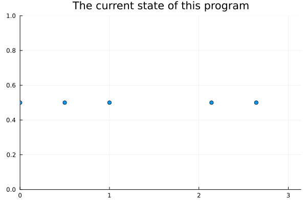

# An $n$-body simulator

This program isn't anything special, just an attempt at writing a generic
$n$-body simulation in Julia. This doesn't really do much differently from
other similar projects. There's still much [to do](TODO.md), so check back
later. This program can perform simulations in any arbitrary number of
dimensions, which is quite cool, but I'm not sure if it's really important—if
you're really into, say, gravity in 6 dimensions, you might really enjoy this
program. Also, it's pretty easy to define any arbitrary force you might want,
though I'm not sure if that's a feature in most other programs like this.

I think it's worth noting this is a hobby project to improve my lackluster
programming skills—if you're looking for serious software, I would highly
suggest you check out [SciML's `NBodySimulator.jl`][sciml], or the excellent
[`DynamicalSystems.jl`][ds] package. This software is inefficient, it will
likely be buggy, and may go without decent documentation—I'm also writing
this program under a considerable creative restraint, using as little outside
code as possible. (It sucks being separated from all of those really nice SciML
packages.)

In the future, I *might* implement a routine for solving the Heisenberg
equations of motion for particles, rather than Hamilton's equations, but
that's a *big maybe*. There would be a lot of linear algebra involved, and
I don't see a point in getting that involved for a hobby project.

This program uses the [MIT license](LICENSE).

[sciml]: https://github.com/SciML/NBodySimulator.jl

[ds]: https://juliadynamics.github.io/DynamicalSystems.jl/dev/ 

[plots]: https://docs.juliaplots.org/stable/
